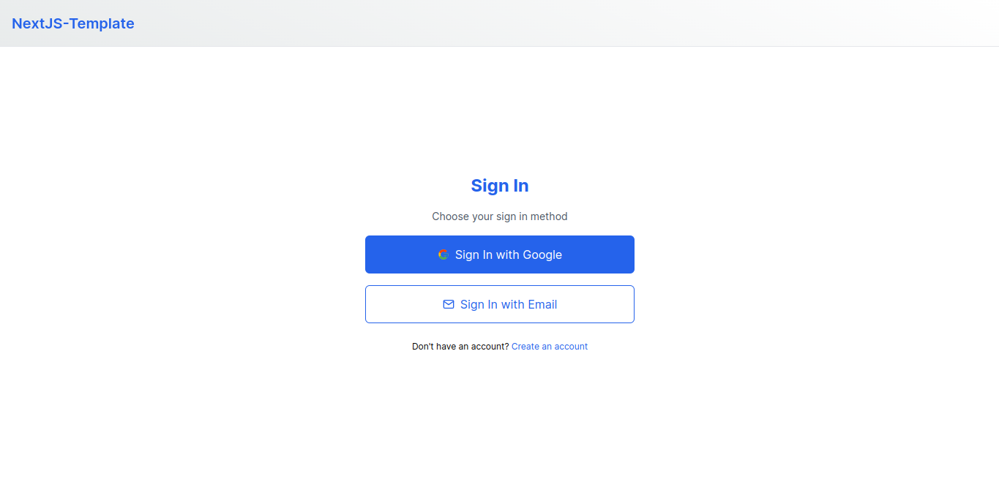
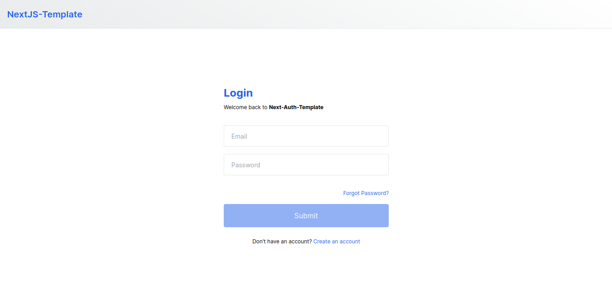
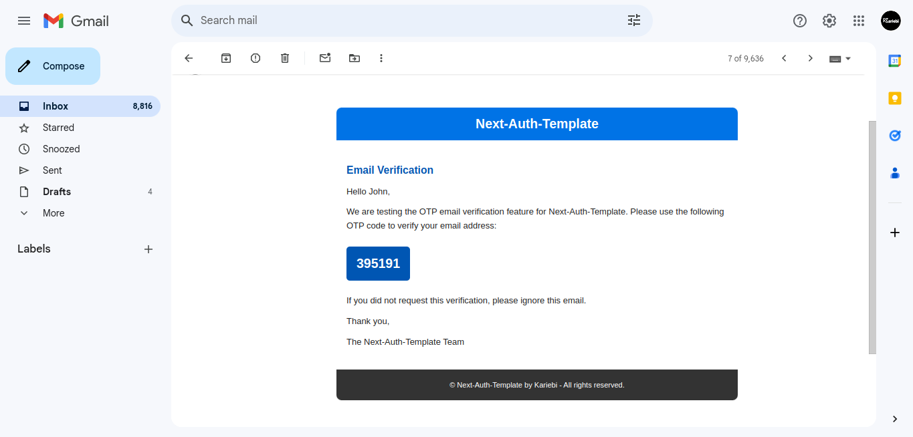
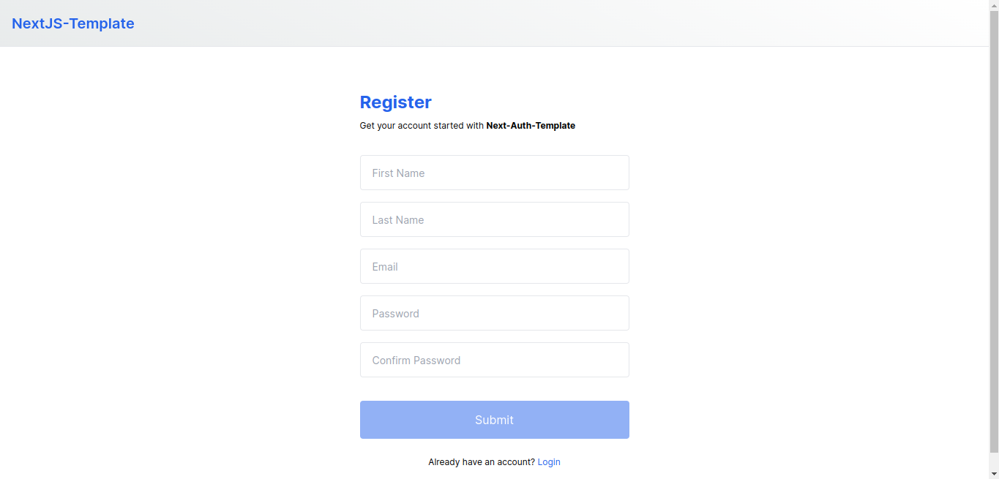

# Next-Auth Template

This project is a comprehensive tutorial on setting up authentication in a Next.js application using Next(without using Next-Auth), PrismaORM, and MongoDB. It covers everything from initial setup to deploying your app.






## Prerequisites

Ensure you have the following installed:

- Node.js (v14.x or later)
- npm, yarn, pnpm, or bun (package managers)
- MongoDB Atlas account
- Google account for OAuth

## Getting Started

First, clone the repository and navigate into the project directory:

```bash
git clone https://github.com/kariebi/next-auth-template.git
cd next-auth-template
```

Install the dependencies:

```bash
npm install
# or
yarn install
# or
pnpm install
# or
bun install
```

Create a `.env` file in the root of the project and add the following environment variables:

```env
# MongoDB connection string
DATABASE_URL='mongodb+srv://<username>:<password>@<clustername>.mongodb.net/<databasename>?retryWrites=true&w=majority&appName=<appname>'

# JWT Secret Keys
REFRESH_TOKEN_SECRET='your-refresh-token-secret-32-or-64-characters-long'
ACCESS_TOKEN_SECRET='your-access-token-secret-32-or-64-characters-long'

# Email configuration for sending OTP
EMAIL_USERNAME='your-email@example.com'
EMAIL_PASSWORD='your-email-password'

# Google OAuth configuration
GOOGLE_CLIENT_ID='your-google-client-id.apps.googleusercontent.com'
GOOGLE_CLIENT_SECRET='your-google-client-secret'
GOOGLE_REDIRECT_URI='/api/auth/google/callback'
```

### Setting Up Prisma

Prisma is an ORM (Object-Relational Mapping) tool that simplifies database interactions.

1. Generate the Prisma Client:

    ```bash
    npx prisma generate
    ```


### Running the Development Server

Start the development server:

```bash
npm run dev
# or
yarn dev
# or
pnpm dev
# or
bun dev
```

Open [http://localhost:3000](http://localhost:3000) with your browser to see the result.


## More Info

If you found this tutorial helpful, please give it a star on GitHub! ⭐

For more information or if you have any questions, feel free to reach out to **Kariebi** on [Twitter](https://twitter.com/kariebi_).

Thank you for your support!

### Learn More

To learn more about Next.js, take a look at the following resources:

- [Next.js Documentation](https://nextjs.org/docs) - learn about Next.js features and API.
- [Learn Next.js](https://nextjs.org/learn) - an interactive Next.js tutorial.

You can check out [the Next.js GitHub repository](https://github.com/vercel/next.js/) - your feedback and contributions are welcome!

### Deploy on Vercel

The easiest way to deploy your Next.js app is to use the [Vercel Platform](https://vercel.com/new?utm_medium=default-template&filter=next.js&utm_source=create-next-app&utm_campaign=create-next-app-readme) from the creators of Next.js.

Check out our [Next.js deployment documentation](https://nextjs.org/docs/deployment) for more details.

```
This README provides a clear and structured guide for setting up a simple Next Authentication template like a MERN stack engineer using Next.js, PrismaORM, and MongoDB. It includes instructions for setting environment variables, initializing Prisma, and running the development server.